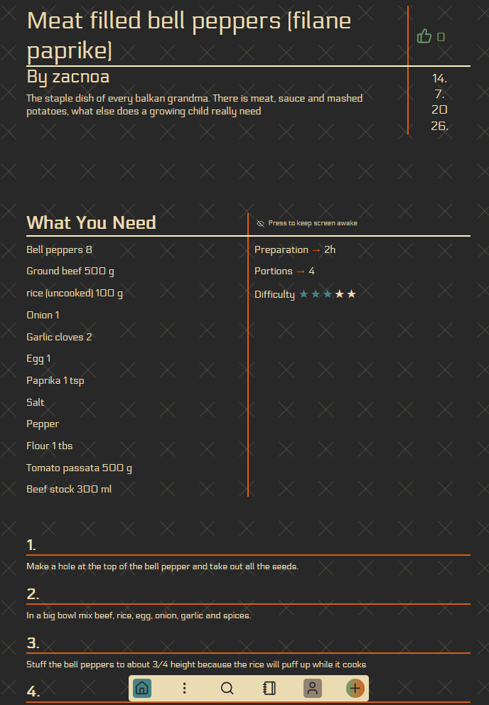
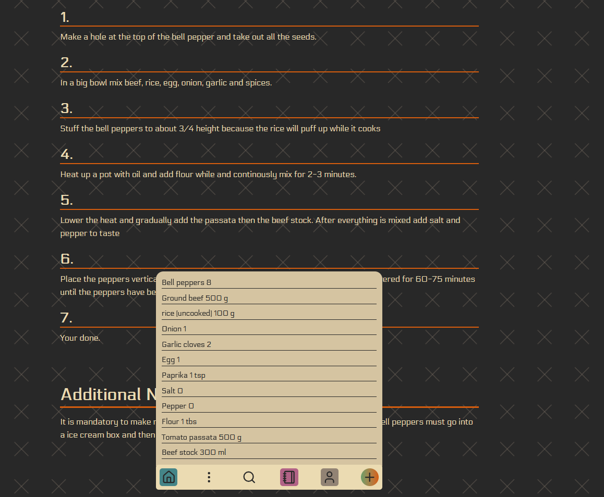
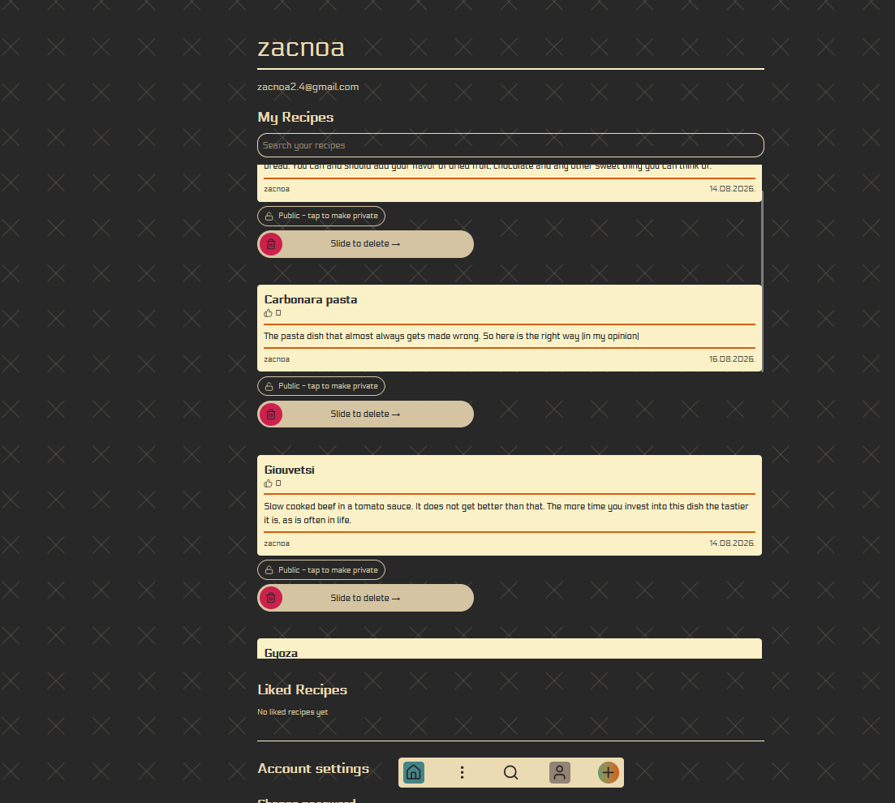
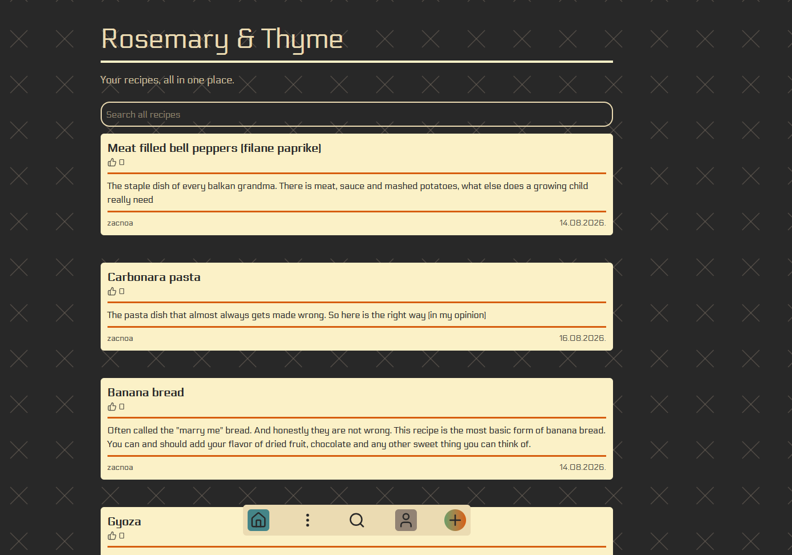

# Rosemary & Thyme

Rosemary & Thyme is, first and foremost, a digital notebook for your recipes, with a small social layer designed to help you discover new ones.

The goal is simple: make writing, organizing, finding, and reading your recipes as convenient as possible.

## What is it?

At the core of Rosemary & Thyme is the recipe editor. It is designed to let users quickly create, edit, find, and read their recipes without unnecessary distractions.

Every user has their own account, with all of their recipes tied to it. This means their personal cookbook is available wherever they go.

Keeping your own recipes organized is, in my experience, about 60% of cooking. Another important part is finding new recipes to steal — or, perhaps more politely, *take inspiration from*. That's where the social aspect of the application comes in.

Users can search through any public recipe by name and discover recipes that closely match their query. If they find something they like, they can save it by liking it. Liked recipes remain available in the **Liked Recipes** section of their dashboard, making them easy to revisit later.

Recipes can also be marked as private, allowing users to decide which parts of their cookbook they want to share.

The social side of Rosemary & Thyme is intentionally kept simple. It isn't supposed to distract from the main purpose of the application: **cultivating your own personal cookbook**.

The intended workflow is therefore fairly simple:

1. Write down and maintain your own recipes.
2. Search for new recipes when you need inspiration.
3. Like recipes you enjoyed so you can easily find them again.
4. If you want to change something, create your own version.

## Motivation

Most recipe websites are primarily blogs, where the actual recipe often occupies only a small portion of the page. At the same time, I haven't found many recipe applications whose UX for actually managing a personal collection of recipes I particularly enjoy.

So I decided to build one.

Rosemary & Thyme is my attempt at creating a recipe application centered around the recipe itself rather than everything surrounding it.

The name **Rosemary & Thyme** comes from the former name of Dandelion's cabaret in *The Witcher 3: Wild Hunt*.

## What's Next

* [ ] **Recipe extraction from images** — Use an LLM to extract recipes from images and semantically format them into the structure expected by Rosemary & Thyme.
* [ ] **Recipe tags** — Add a tagging system to make organizing and searching through recipes easier.
* [ ] **Recipe forking** — Allow users to fork another user's recipe and create their own modified version while preserving its history.

The last one doesn't necessarily solve a major problem — I just think it's a neat idea.

Most recipes are, after all, variations of something that came before them. Given enough modifications, recipes can form surprisingly long family trees. Tracking those relationships digitally could make it possible to see how a recipe evolved and trace different versions back to their origins.
